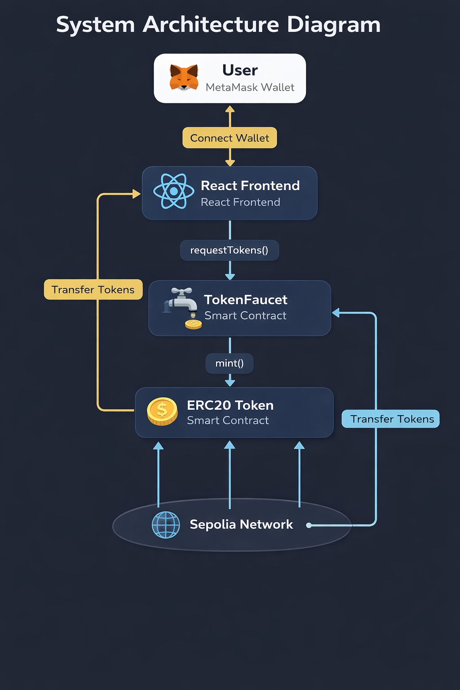
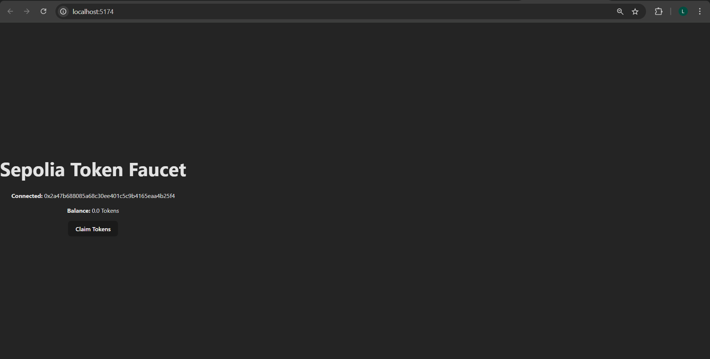

#  Sepolia Token Faucet dApp

A full-stack Web3 decentralized application (dApp) that allows users to claim ERC-20 tokens from a rate-limited faucet deployed on the Sepolia testnet.

This project demonstrates smart contract development, frontend Web3 integration, Docker deployment, and full evaluation interface support.

---

#  Project Overview

This project consists of:

-  ERC-20 Token Smart Contract
-  Faucet Smart Contract with:
- 24-hour cooldown
- Lifetime claim limit
- Pause functionality
-  React + Vite Frontend
-  Dockerized Deployment
-  Health Check Endpoint
-  Etherscan Verified Contracts
-  Evaluation Interface Support

---
###  Architecture Diagram



---

##  System Architecture Explanation

1. User connects wallet via MetaMask
2. Frontend connects to Faucet smart contract
3. User requests tokens
4. Faucet contract:
   - Checks pause state
   - Checks 24-hour cooldown
   - Checks lifetime claim limit
   - Transfers tokens from Token contract
5. Event emitted
6. Frontend updates balance
---
```
User -->|Connect Wallet| Frontend
Frontend -->|requestTokens()| Faucet
Faucet -->|mint()| Token
Token -->|Transfer Tokens| User
Faucet --> Sepolia
Token --> Sepolia
Frontend --> Sepolia
```

---

##  Contract Interaction Flow

1. User connects MetaMask
2. Frontend checks:
   - Token balance
   - Claim eligibility
3. User clicks "Claim Tokens"
4. Faucet validates:
   - Not paused
   - Cooldown passed
   - Lifetime limit not reached
5. Faucet mints tokens via Token contract
6. Balance updates in UI

---

#  Repository Structure

```
TokenFaucet/
│
├── contracts/
│   ├── Token.sol
│   └── TokenFaucet.sol
│
├── scripts/
│   └── deploy.js
│
├── test/
│   └── TokenFaucet.test.js
│
├── frontend/
│   ├── src/
│   ├── Dockerfile
│   ├── server.js
│   └── package.json
│
├── docker-compose.yml
├── hardhat.config.js
├── .env.example
└── README.md
```

---

#  Smart Contract Details

##  ERC-20 Token

- Standard OpenZeppelin ERC-20 implementation
- Mintable only by Faucet contract
- Verified on Etherscan

##  TokenFaucet

Features:
- 24-hour cooldown per wallet
- Maximum lifetime claim limit
- Admin pause functionality
- Event emission for claims

Security Measures:
- Access control
- Reentrancy-safe design
- Explicit revert messages

---

# Deployed Contracts (Sepolia)

##  Token Contract
Address:
```
0x05ee75359EBbC0fB29ae76bc0a7E078Baa0A8f24
```

Etherscan:
https://sepolia.etherscan.io/address/0x05ee75359EBbC0fB29ae76bc0a7E078Baa0A8f24#code

---

##  Faucet Contract
Address:
```
0xB5e68a59C63ab7d47C0F93cd571605AEcF7EB9E6
```

Etherscan:
https://sepolia.etherscan.io/address/0xB5e68a59C63ab7d47C0F93cd571605AEcF7EB9E6#code

---

#  Frontend Features

- Connect MetaMask Wallet
- Display Connected Address
- Display Token Balance
- Claim Tokens Button
- Cooldown Error Handling
- Success Notifications
- Clean UI
- Responsive Layout

---

#  Docker Deployment

##  Build & Run

From project root:

```bash
docker compose up --build
```

---

##  Access Application

Frontend:
```
http://localhost:3000
```

Health Endpoint:
```
http://localhost:3000/health
```

Health response:
```json
{ "status": "ok" }
```

---

#  Local Development (Without Docker)

## 1️ Install dependencies

```
npm install
```

## 2️ Start frontend

```
npm run dev
```

## 3️ Compile contracts

```
npx hardhat compile
```

## 4️ Deploy to Sepolia

```
npx hardhat run scripts/deploy.js --network sepolia
```

---

#  Testing

Run tests:

```
npx hardhat test
```

Coverage includes:
- Claim success
- Cooldown enforcement
- Lifetime limit
- Pause functionality
- Access control
- Event emission

---

# 🔧 Environment Variables

Create `.env` from `.env.example`

```
SEPOLIA_RPC_URL=
PRIVATE_KEY=
ETHERSCAN_API_KEY=
```

⚠️ Never commit private keys.

---


```markdown

```

---

#  Security Considerations

- Reentrancy-safe minting
- Proper access control
- Cooldown state tracking
- Explicit revert reasons
- Limited minting authority

---

#  Gas Considerations

- Optimized state updates
- Minimal storage writes
- No unnecessary loops

---

#  Design Decisions

- ERC-20 used for standard compatibility
- Faucet separated from token for modularity
- Cooldown stored per-user mapping
- Docker for consistent deployment
- Health endpoint for automated evaluation

